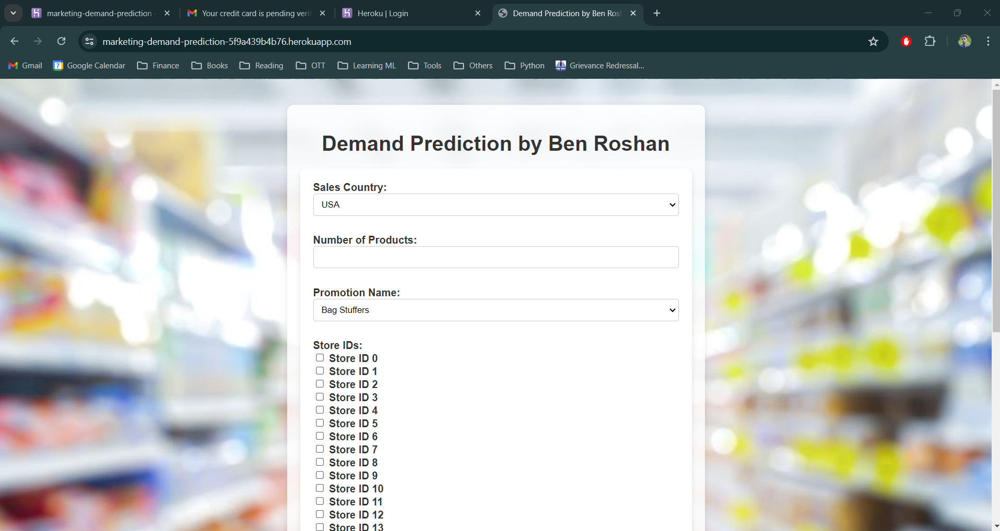
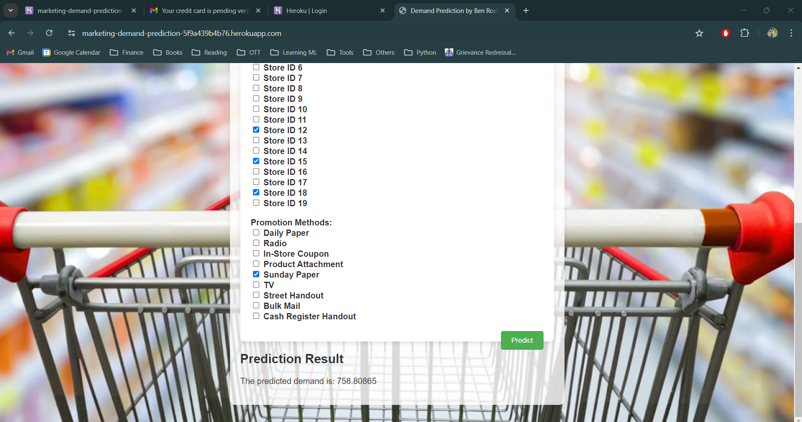

# Marketing Campaign Demand Prediction




## Project Overview

This project aims to predict campaign demand(number of customers) using a dataset containing various features related to marketing campaign by a supermarket. The model is built using Python and utilizes libraries such as Pandas, NumPy, and XGBoost for model prediction. The application is also deployed on Heroku for easy access.

## Data Description
This is a campaign data of Food Mart (chain of convenience stores in US) where each record is a transaction of a customer in response to a campaign and their corresponding cost incurred to acquire the customer for that campaign.

## Raw Data 
The raw dataset contains the following features:

1. food_category- food type
2. food_department- department the food belongs to
3. food_family- family the food belongs to
4. store_sales- sales in million dollars 
5. store_cost- expenses in million dollars
6. unit_sales - quantity of sales in millions 
7. promotion_name- name used for promotion
8. sales_country- country where sale happen
9. marital_status- marital status of customer
10. gender- gender of customer
11. total_children- total children in home
12. education- education level of customer
13. member_card- member card of customer
14. occupation- occupation of customer
15. houseowner- if customer is a house owner or not 
16. avg_cars_at_home- average number of cars at customer's house
17. avg.yearly_income- yearly income range of customer
18. num_children_at_home- number of children for customer
19. brand_name- brand name of product purchase
20. SRD- Max retail price of item
21. gross_weight- gross weight of item 
22. net_weight- net weight of item
23. recyclable_package- whether the food item is in a recyclable packaging or not
24. low_fat - whether the food item is low on fat or not 
25. units_per_case- number of units per case available on store shelves
26. store_type - type of store
27. store_city - city where store belongs
28. store_state- state where store belongs 
29. store_sqft- store area in sqft
30. grocery_sqft- grocery area available in sqft
31. frozen_sqft- frozen food area available in sqft
32. meat_sqft- meat area available in sqft
33. cofee_bar- coffee bar available in store or not
34. video_store- video store available in store or not 
35. salad_bar- salad bar counter available in store or not 
36. prepared_food- prepared food available in store or not
37. florist- flower shelves available in store or not
38. media_type- media source for campaign
39. cost- cost on acquiring the customer in dollars


## Model data
The model is training on the following data points. The model predicts for the given promotion features, what is the expected demand
1. sales_country: The country where the sales are occurring.
2. n_products: The number of products.
3. promotion_name: The name of the promotion being applied.
Store IDs (boolean values indicating whether the store is selected or not):
4. store_id_0
5. store_id_1
6. store_id_2
7. store_id_3
8. store_id_4
9. store_id_5
10. store_id_6
11. store_id_7
12. store_id_8
13. store_id_9
14. store_id_10
15. store_id_11
16. store_id_12
17. store_id_13
18. store_id_14
19. store_id_15
20. store_id_16
21. store_id_17
22. store_id_18
23. store_id_19

Promotion types (integer values where 0 or 1 indicates whether the promotion type is selected or not):
24. Daily_Paper: Indicates if the Daily Paper promotion is selected.
25. Radio: Indicates if the Radio promotion is selected.
26. In_Store_Coupon: Indicates if the In-Store Coupon promotion is selected.
27. Product_Attachment: Indicates if the Product Attachment promotion is selected.
28. Sunday_Paper: Indicates if the Sunday Paper promotion is selected.
29. TV: Indicates if the TV promotion is selected.
30. Street_Handout: Indicates if the Street Handout promotion is selected.
31. Bulk_Mail: Indicates if the Bulk Mail promotion is selected.
32. Cash_Register_Handout: Indicates if the Cash Register Handout promotion is selected.

The target column is **'target'**, which indicates the expected demand

## Model and Libraries

- **Pandas**: Data manipulation and analysis
- **NumPy**: Numerical computations
- **XGBoost**: Model prediction

## Deployment

The application is deployed on Heroku and can be accessed via the following link: (The following link is fake concerning the costs)

[Campaign Demand Prediction on Heroku](https://hotelbooking-cancellation-pred-e23654698b90.herokuapp.com/)

## Usage
### API Endpoints
#### Home
- URL: /
- Method: POST
- Description: Renders the home page and lets the user feed the input data for prediction

## How to Run Locally

To run the Marketing Campaign Demand Prediction project locally, follow these steps:

1. **Clone the repository**:

    ```sh
    git clone https://github.com/BenRoshan100/Marketing-Campaign-Demand-Prediction.git
    ```

2. **Navigate to the project directory**:

    ```sh
    cd Marketing-Campaign-Demand-Prediction
    ```

3. **Install the required packages**:

    ```sh
    pip install -r requirements.txt
    ```

4. **Run the application**:

    ```sh
    python main.py
    ```

5. **Open your web browser and go to**:

    ```sh
    http://127.0.0.1:5000/
    ```

You should now be able to access the application locally and use its features for predicting demand.

## License

This project is licensed under the personal License.

## Acknowledgments

- The dataset and inspiration for the project: [Hotel Booking Cancellation Prediction Dataset on Kaggle](https://www.kaggle.com/datasets/youssefaboelwafa/hotel-booking-cancellation-prediction)
- Python and its libraries:
  
- Pandas:
  
- NumPy:
  
- XGBoost:
  
- Flask for the web framework.
- iNeuron Institute for the data pipeline flow
- Heroku for hosting the application.

